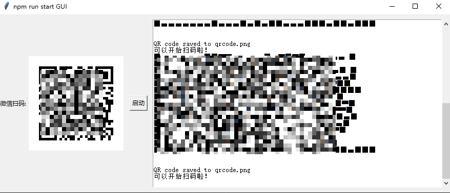

# wx-wchaty-robot

## 项目说明
---
* 空闲开发，原本只是自用，不确定会不会有其他bug
* 该项目初衷只是为了可以实现群消息转发
* 自行安装npm包，因为太多了我也忘记了
---
## 本地使用
---
```
# 安装包
$ npm install wechaty qrcode-terminal qr-image fs

# 初始化
$ npm i 

# 把群名填写到 group

# 启动
$ npm run start

```
## 关于 main.py
原本想法是把这一整个项目整合成一个exe可执行文件。但是node是服务端，我整合不了。相当于只写了一半。GUI我是用py写的。环境是py38。可以直接 
```
$ python main.py
```
执行即可调出GUI

## 关于main.exe
已用pyinstaller打包成了一个exe。win10环境下可以直接打开。

---
## main.py截图


